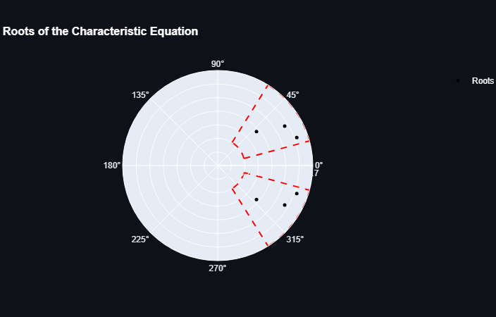
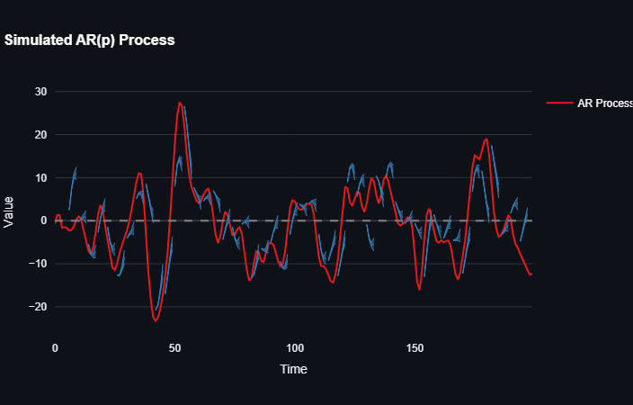
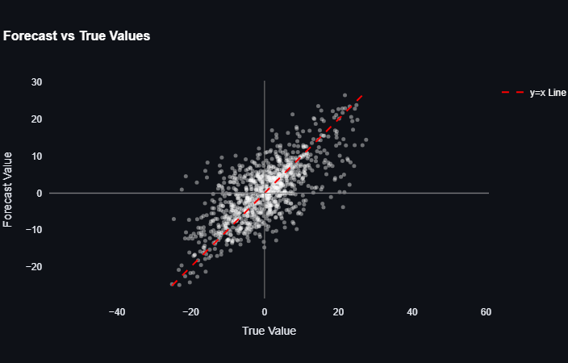

# Autoregressive (AR) Time Series Simulation and Forecasting
You can access this app on streamlit servers by clicking on the link below:

[](https://hamidabbasi-r-autoregressive-models-main-uaried.streamlit.app/)

This project demonstrates the synthesis, estimation, and forecasting of autoregressive (AR) time series. It includes tools for generating stationary AR processes, estimating model parameters, and evaluating forecast quality.

## Features
- **AR Process Simulation**: Generate synthetic time series data using AR models.
- **Parameter Estimation**: Estimate AR coefficients from simulated or real data.
- **Forecasting**: Perform multi-step forecasts with confidence intervals.

## Requirements
- Python 3.x
- Libraries: `numpy`, `scipy`, `plotly`, `matplotlib`, `streamlit`

## Usage
1. Clone the repository:
   ```bash
   git clone https://github.com/HamidAbbasi-R/Autoregressive-Models.git
   cd Autoregressive-Models
   ```
2. Install dependencies:
   ```bash
   pip install -r requirements.txt
   ```
3. Run the Streamlit app:
   ```bash
   streamlit run main.py
   ```
## Examples

### Figure 1: Roots of the AR Characteristic Polynomial


### Figure 2: Time Series Simulation with Forecasting Results


### Figure 3: Comparison of Forecasted vs Actual Values
